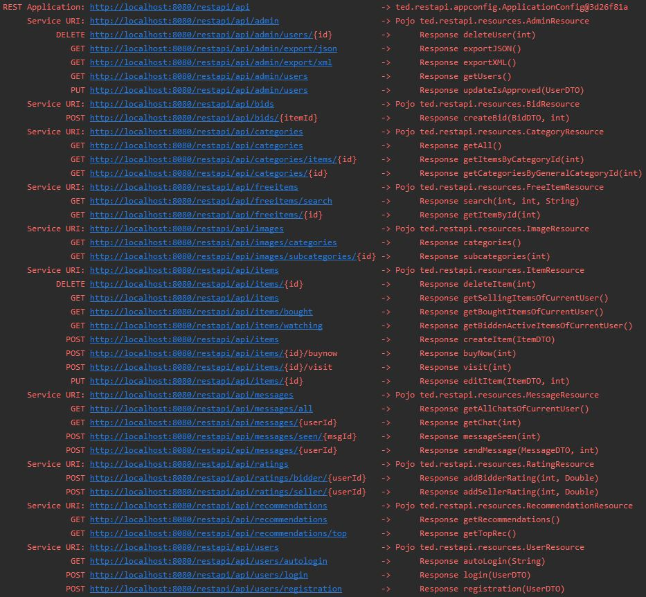
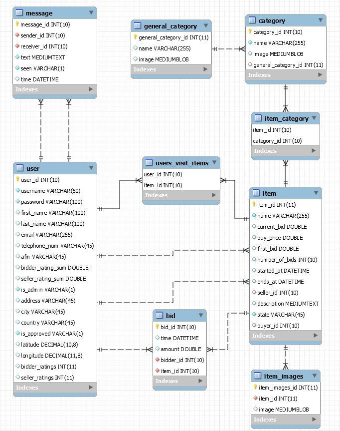

# REST API (Java EE)

## Deployment

#### TomEE Maven Plugin 7.0.5 (SSL unavailable)

* Ensure that SSL is disabled on endpoints: [web.xml](src/main/webapp/WEB-INF/web.xml).
* Datasource Configuration: [resources.xml](src/main/webapp/WEB-INF/resources.xml)
1. $ mvn clean install
2. $ mvn package
3. $ mvn tomee:run

#### [TomEE Plus 8.0.0](https://tomee.apache.org/download-ng.html) (SSL available)

* Configure Datasource: **conf/tomee.xml**.
* Enable SSL on server: **conf/server.xml**.
    * A keystore file must be available for the server.
* Enable SSL on endpoints: [web.xml](src/main/webapp/WEB-INF/web.xml).
* Deploy the war file into the server.

## Specs

* Implementation
    * Java EE
    * JPA with EclipseLink provider
    * Database: MySQL
* Maven used for project build and management: [pom.xml](pom.xml).
* Persistence Layer configuration: [persistence.xml](src/main/resources/META-INF/persistence.xml)
* Web Filters & SSL enable/disable: [web.xml](src/main/webapp/WEB-INF/web.xml)
    * [CORS Filter](src/main/java/ted/restapi/filters/CORSFilter.java) used for all endpoints.
    * [Auth Filter](src/main/java/ted/restapi/filters/CORSFilter.java) used for all endpoints that require a session.
* Recommendation Algorithm: Nearest Neighbor Collaborative Filtering
    * The current user gets recommendations based on the preferences of his neighbors, who are users that have similar preferences with current user.
    * The guest user gets recommendations based on the most popular items, which are the active items with the most bids.
* [jBCrypt](https://www.mindrot.org/projects/jBCrypt/) used  for hashing user passwords in database.
* [JWT](https://jwt.io/) used for user session management. The token also stores the current user's data for access control.

## Endpoints

[TomEE Plus 8.0.0](https://tomee.apache.org/download-ng.html) deployment

## Database (MySQL)

A sample database script is provided [here](db_script.sql)

#### Author

[Kostis Michailidis](https://github.com/kostismich7)
